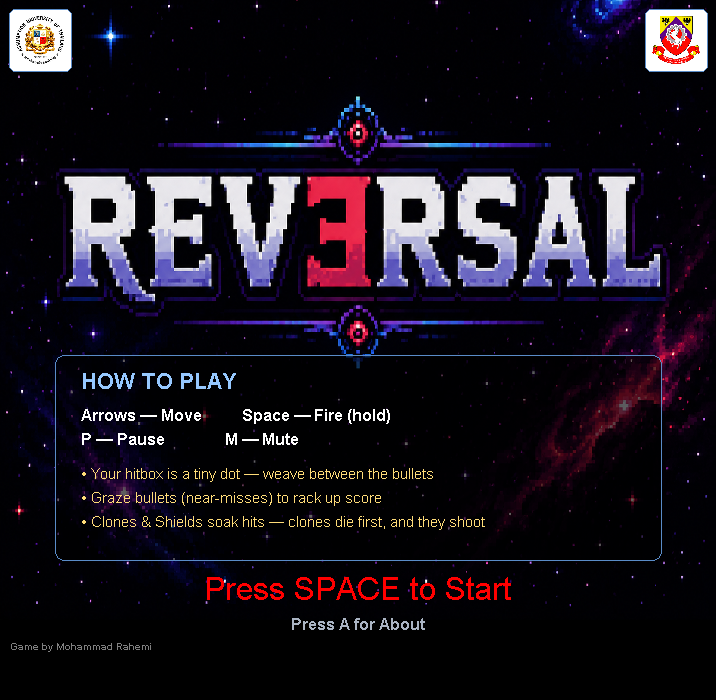
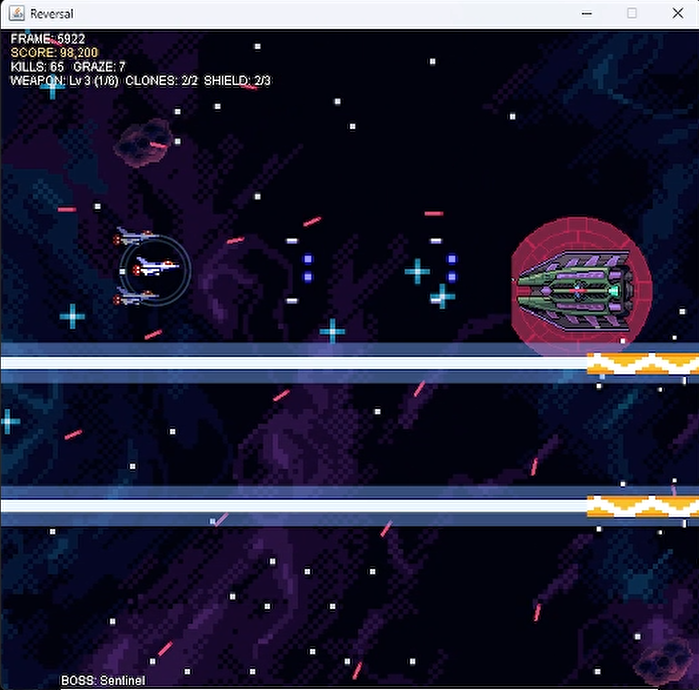
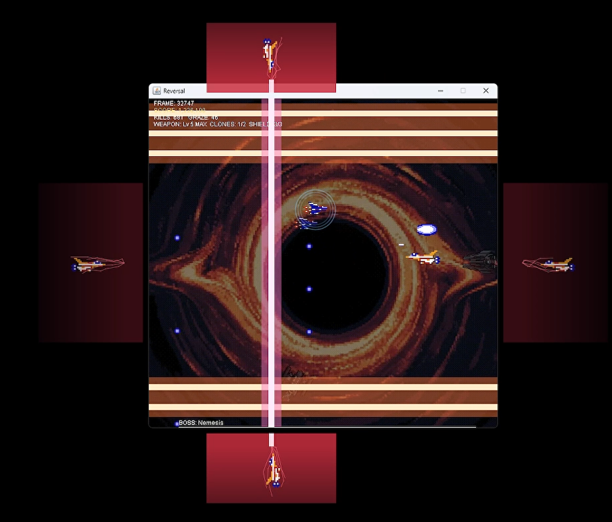
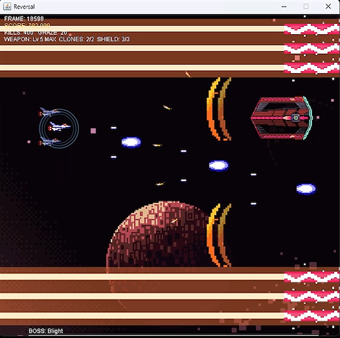

# REVERSAL

**You will beat the final boss. That's not the twist. The twist is what you do with the body.**



A bullet-hell shooter about winning too hard. Three fleets stand between you and the end
of the war. You will burn through all of them. And when the last flagship — *Nemesis* — is
a cloud of hot scrap, you'll fly through the wreckage and pick up a shard of it. Because
it's right there. Because it made you feel small. Because it's *power*.

Take five, and there's nothing left of you to save.

---

## The pitch

Every shooter tells you to kill the boss. **REVERSAL** lets you *become* it — and then
shows you exactly what that's worth.

- **A screen full of death, and a hitbox the size of a dot.** Your ship is 48 pixels wide.
  The part of it that can actually be killed is 12. Bullets tear past your wings by a
  hair's breadth and you live, every time, because you *chose* to be there.
- **Get paid for nerve.** Skim a bullet without touching it and you **graze** it — points,
  instantly, for the near-miss. Playing it safe is playing it poor. The scoreboard rewards
  the pilot who flies *into* the pattern.
- **Two fleets, two philosophies, two ways to die.** The Nairan carve the arena into
  lethal bands and dare you to pick a lane. The Kla'ed wall it in *permanently* — every
  chunk of health you take off their flagship slams another door, until you're duelling a
  dreadnought inside a corridor you built yourself.
- **Then there's Nemesis.** Your ship. Your guns. In red. It remembers every boss you've
  already beaten and puts them back on the table one at a time as its health drops — the
  Nairan rays, the Kla'ed walls, and finally vertical beams as reality itself starts to
  come apart at the seams.
- **An endless run that never repeats.** No fixed level list. A live director watches how
  you're doing, builds each wave out of formations on a growing budget, and drops a boss
  gate when the tension's right. Clear the authored run and it loops — harder, every lap.

<!-- Screenshot slot: mid-run bullet pattern, biome 1 (Nairan) -->
<!--  -->

## The turn

Kill Nemesis and the game does not end. It hands you the wreckage.

Red **corruption shards** start dropping. Each one you take:

- stains your hull one shade further from blue toward Nemesis red,
- widens the **Ray** — Nemesis's own signature beam, now yours, firing forward through
  everything in its lane.

Five shards and the transformation is complete. The screen tears open. You take the
boss's side of the arena — the right — and you turn to face the left, where a small blue
ship has just flown in.

It's you. The version of you that started this run.

It is invincible. It grinds your health bar down while you throw everything Nemesis ever
had at it, and the words on screen tell you the truth you already know:

> **FIGHT YOUR PAST SELF — YOU CANNOT WIN**

You are the boss now. Somebody else is coming for you. The loop closes.

> *"YOU NEVER LEARN, DO YOU?"*

<!-- Screenshot slot: the final loop — red you vs. blue past self -->
<!--  -->

## Build the pilot you want

Kills drop upgrades. Nothing here makes you faster — this game is about *precision*, and
you'll want every pixel of control you've got.

| Drop | What it does |
| --- | --- |
| **Weapon Up** | Five tiers, from a single pellet to a plasma comet that deletes what it touches. Higher tiers cost more pips, so your firepower ramps across the whole run instead of maxing out in the first biome. |
| **Clone** | A ghost ship flies your wing. It shoots. It also eats one lethal hit for you. Up to two. |
| **Shield** | A charge that breaks instead of you — but only *after* your clones are gone. Up to three. |
| **Corruption** | Unlocked only after Nemesis falls. There is no way to put it back. |

<!-- Screenshot slot: powered-up loadout / boss fight -->
<!--  -->

## Controls

| Key | Action |
| --- | --- |
| **Arrow keys** | Move (full 2D — you own the left third of the arena) |
| **Space** | Fire (hold it down) |
| **P** | Pause |
| **M** | Mute |
| **A** | About / credits (from the title screen) |

## Play it

Requires **Java 17+**. Run from the project root — the game loads its art and music from
relative paths.

**Windows (PowerShell):**

```powershell
javac -encoding UTF-8 -d out (Get-ChildItem -Recurse src -Filter *.java | ForEach-Object { $_.FullName })
java -cp out gdd.Main
```

**macOS / Linux:**

```bash
find src -name "*.java" > sources.txt && javac -encoding UTF-8 -d out @sources.txt
java -cp out gdd.Main
```

Press **SPACE** on the title screen and go.

There's also a landing page in **[docs/index.html](docs/index.html)** — open it in a
browser for the pitch with a playable slice of the arena running in it.

## Under the hood

Pure Java and Swing — no game engine, no external libraries. A 60 FPS update/draw loop, a
data-driven enemy roster, a runtime wave director, and sound effects synthesised in code.
If you want the tour of how it all fits together, that's in **[Structure.md](Structure.md)**.

## Credits

Built as a Game Design & Development project at **Assumption University of Thailand**.

- Mohammad Rahemi — 6611695
- Mankirat Kaur — 6611585

Descended from [janbodnar/Java-Space-Invaders](https://github.com/janbodnar/Java-Space-Invaders),
which is where the first pellet came from and very little else survives.
